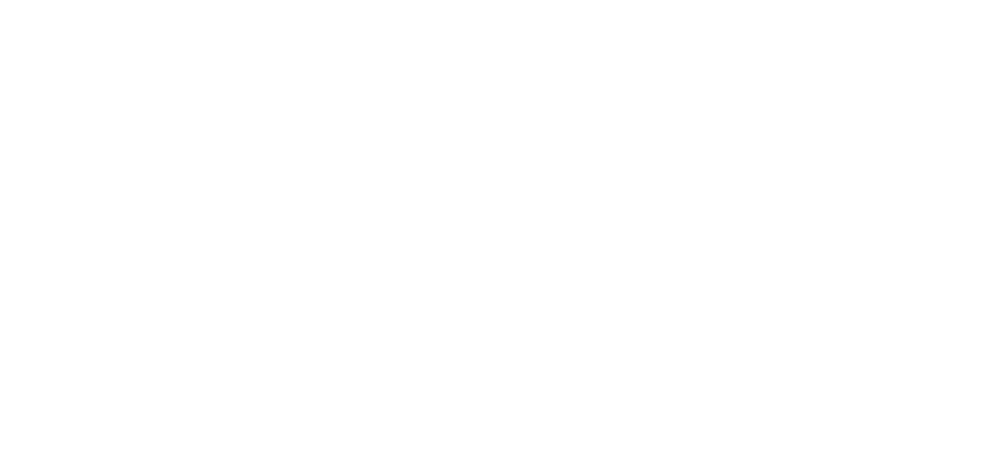

<a style="margin:20px auto;">

<a/>

**OpenAI PHP** for PHP is a supercharged community PHP API client that allows you to interact with the [Open AI API](https://beta.openai.com/docs/api-reference/introduction).

> **Note:** This repository contains the artwork of the **OpenAI PHP** for PHP. Please check our main repository to get started with our API Client: [openai-php/client](https://github.com/openai-php/client).

---
<!--  --> 

OpenAI PHP for Laravel is an open-sourced software licensed under the **[MIT license](https://opensource.org/licenses/MIT)**.
